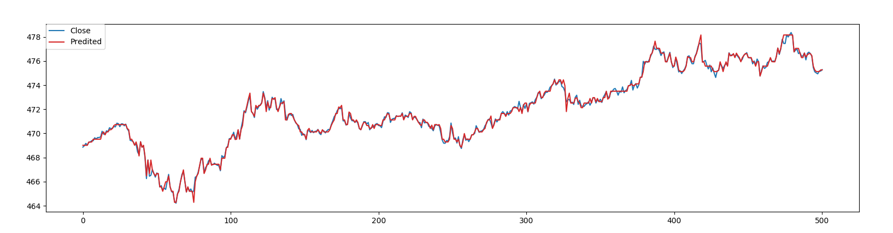

# DecisionTree Regression


[](https://www.codefactor.io/repository/github/tgey/decisiontree)


## Introduction

This personal project is based on a part of my trading robot to discover the learning machine. The raw decision tree algorithm now a decision tree regressor by machine learning.

A decision tree is a decision support tool that uses a tree-like graph or model of decisions and their possible consequences, including chance event outcomes, resource costs, and utility. It is one way to display an algorithm that only contains conditional control statements.



## Features/ Roadmap
- [x] **Based on Python 3.5.2**: For botting on any operating system -
Windows, macOS and Linux
- [x] **Using Binance API**: replace 'api_key' and 'secret_key' by yours in mybinance.py
- [x] **2D plotting with Matplotlib**
- [x] **Machine Learning - Predicting price**: Decision Tree Regressor
- [ ] **Machine Learning - Buy/sell decision**
- [ ] **Optimization of the choice of currency**: Monte Carlo Rebalancing
- [ ] **Graphical interface**
- [ ] **Dry-run**: Run the bot without playing money.

## Quick start

```bash
git clone https://github.com/tgey/DecisionTree.git
cd DecisionTree
python3 main.py <pair> [frequency]
```

### Replace 'api_key' and 'secret_key' by yours in mybinance.py

For exemple:
> python3 main.py ETHUSDT 60
